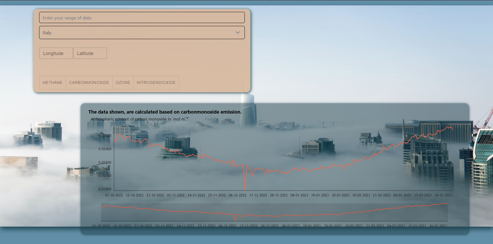
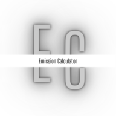

# Emission Calculator

<strong>Emission Calculator</strong> is a web app that allows you to see the carbonmonoxide, ozone, methane or nitrogendioxide emissions. The search can be conducted by country, date range or by providing a specific coordinate.

## Built With

<ul>
  <li>  REACT</li>
  <li>  PRIMEREACT</li>
  <li>  M-UI</li>
  <li>  REACT ROUTER</li>
  <li>  STYLED COMPONENTS</li>
  <li>  FRAMER MOTION</li>
</ul>

## Try it

  

<h3 align="center">Emission Calculator</h3>

  

    <a href="https://emission-calculator.netlify.app/"><strong>Calculate »</strong></a>

